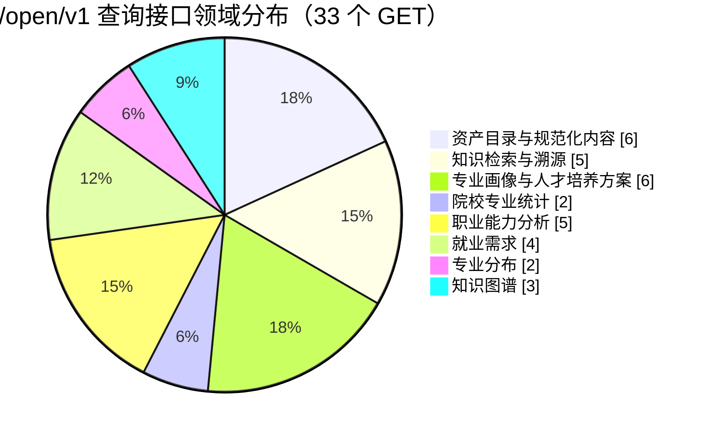

# Open API 查询接口性能测试报告

**P0 优化后复测时间**：2026-08-27 10:29:16（Asia/Shanghai）
**目标环境**：宿主机常驻 `uvicorn`，`http://127.0.0.1:8000`（`development`）；Worker 与爬虫调度禁用。
**结论**：**P0 聚合优化后，连接、认证和应用成功率通过（200/200，100%）；两项院校统计聚合 P95 已降至 49.437 ms 和 168.866 ms。资产目录 P95 为 316.574 ms，仍未达到 `SPEC.md` 的 < 200 ms 目标。**

| 项目 | 结果 |
| --- | --- |
| 测试范围 | 10 个无需数据依赖 ID 的认证 GET 列表/聚合端点；排除外网搜索、Query Router、SSE、正文/下载和依赖资源 ID 的详情读取 |
| 认证 | 使用用户提供的 API Caller Key；未写入文件、日志或本报告 |
| 负载设计 | 预验证：每端点 2 次、并发 2，20/20 为 `200`；正式：每端点 20 次、并发 4、超时 10 秒 |
| 总量与结果 | 200 请求，200 个 `200`，无传输、认证或应用错误；用时 6.224 s，端到端吞吐量 32.14 RPS |
| 测量覆盖率 | 文档列 33 个 GET 查询路由；本轮核心列表/聚合性能语料覆盖 10/33（30.3%）。未测的 ID/正文/下载/检索/问答接口不能据此判定 |

| 实测端点 | 成功/样本 | P50 ms | P95 ms | P99 ms | 判定 |
| --- | ---: | ---: | ---: | ---: | --- |
| `/open/v1/assets` | 20/20 | 244.780 | 316.574 | 347.175 | **未达标**：P95 > 200 ms |
| `/open/v1/major-profiles` | 20/20 | 20.234 | 31.934 | 31.966 | 正常 |
| `/open/v1/talent-training-plans` | 20/20 | 668.633 | 832.327 | 974.552 | 无专属目标；需关注 |
| `/open/v1/major-offerings/aggregate` | 20/20 | 34.202 | 49.437 | 115.450 | **P0 通过** |
| `/open/v1/major-courses/aggregate` | 20/20 | 149.367 | 168.866 | 174.015 | **P0 通过** |
| `/open/v1/record-assets/ability-analyses` | 20/20 | 14.244 | 43.228 | 103.778 | 正常 |
| `/open/v1/record-assets/job-demand-records` | 20/20 | 25.325 | 32.804 | 35.784 | 正常 |
| `/open/v1/record-assets/job-demand-records/aggregate` | 20/20 | 21.297 | 25.939 | 26.203 | 正常 |
| `/open/v1/record-assets/major-distribution-records` | 20/20 | 18.901 | 55.629 | 56.125 | 正常 |
| `/open/v1/record-assets/major-distribution-records/aggregate` | 20/20 | 16.669 | 44.671 | 45.072 | 正常 |

| P0 聚合优化对比 | 优化前 P95 ms | 优化后 P95 ms | 降幅 |
| --- | ---: | ---: | ---: |
| `/open/v1/major-offerings/aggregate` | 8,014.864 | 49.437 | 99.38% |
| `/open/v1/major-courses/aggregate` | 8,312.665 | 168.866 | 97.97% |

## 风险与处置

P0 已将统计路由的重复宽对象加载移除：`offerings` 不加载课程，`courses` 只加载统计字段；过滤条件下推至 SQL，覆盖率分母按省预计算。下一优先级是按既有“Open Asset Catalog Query Efficiency”任务包修复 `/open/v1/assets` 的 SQL 过滤、计数、分页和批量加载。已提供 [`open_api_query_perf.py`](../../tools/open_api_query_perf.py)，它从 `NEXUS_OPEN_API_KEY` 读取密钥、仅执行 GET、默认每端点 20 次且并发 4，并将不含密钥或正文的汇总 JSON 写入指定路径。推荐执行：

```bash
NEXUS_OPEN_API_KEY='***' python3 tools/open_api_query_perf.py \
  --base-url http://127.0.0.1:8000 \
  --requests-per-endpoint 20 --concurrency 4 \
  --output /tmp/open-api-query-perf.json
```

## 查询接口领域分布图

文档列出 **33 个 GET 查询端点**；下图按业务领域归类，所有端点均要求 API Caller 认证。



| 领域 | 端点数 | 覆盖资源 |
| --- | ---: | --- |
| 资产目录与规范化内容 | 6 | assets、版本、normalized ref、治理结果、正文 |
| 知识检索与溯源 | 5 | chunk、ref chunks、原文下载 URL、search、qa |
| 专业画像与人才培养方案 | 6 | major profiles、plans、课程知识图谱、岗位能力图谱 |
| 院校专业统计 | 2 | major offerings / courses aggregate |
| 职业能力分析 | 5 | analysis、任务、能力项、关系 |
| 就业需求 | 4 | records、aggregate、详情、requirements |
| 专业分布 | 2 | records、aggregate |
| 知识图谱 | 3 | job / occupational / teaching-standard graphs |

注：资产详情返回中的版本和当前规范化引用属于 `/assets/{asset_id}` 的响应字段，不额外计作端点；因此图中资产/规范化类严格按 3 个 assets 路由和 3 个 normalized-ref 路由计数。
